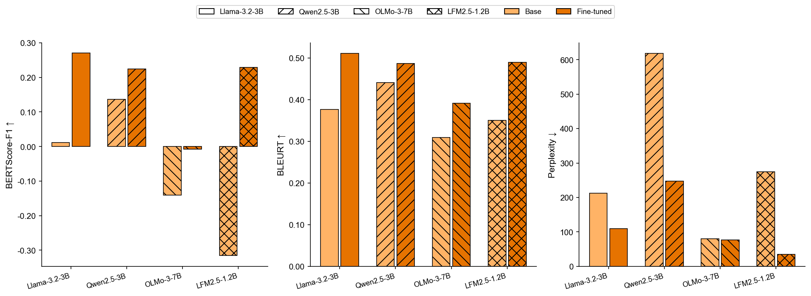
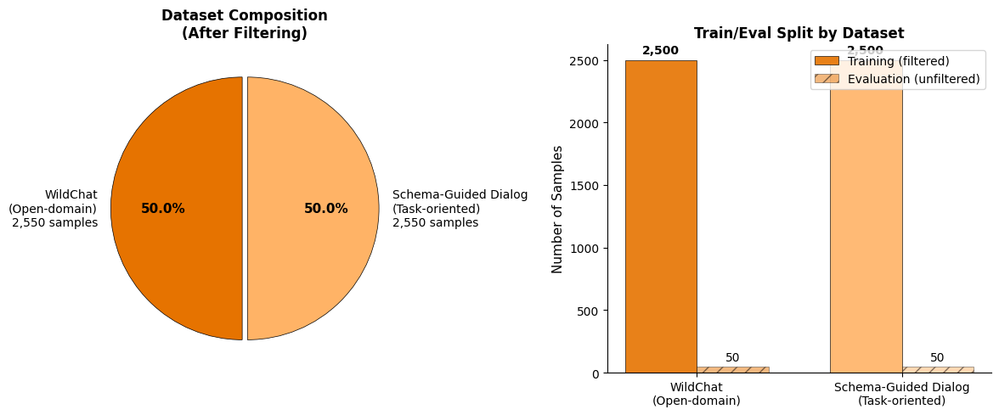

# User Turn LoRA

Fine-tuning LLMs to predict user turns in conversations.

## Model Performance Overview



## Project Structure

```
├── create_plots.py          # Main script to generate thesis figures
├── modules/
│   ├── plot1.py             # Benchmark comparison (Base vs Fine-tuned)
│   ├── plot2.py             # Domain-specific analysis
│   └── helpers.py           # Utility functions
├── Qwen/
│   └── Qwen2.5-3B-Instruct/  # Model evaluation results
│       ├── eval_bleurt_bertscore_summary.csv
│       ├── eval_ft_bleurt_bertscore_summary.csv
│       ├── chat_pairs.json
│       ├── *.png             # Generated plots
│       └── wandb_screenshot.png  # WandB run report
└── UserTurnLoRA.ipynb       # Main experiment notebook
```

## Generating Plots

```bash
# Process all discovered models
python create_plots.py

# Process specific model directory
python create_plots.py --model-dir Qwen/Qwen2.5-3B-Instruct

# List available models
python create_plots.py --list-models

# Quiet mode (suppress verbose output)
python create_plots.py --quiet
```

## Environment

Successfully run on **Google Colab A100 GPU**.

> ⚠️ **Note**: Tests on Colab H100 and RunPod H100 failed due to BLEURT library compatibility issues.

## Notes

- Any Hugging Face Transformers text model that supports the `apply_chat_template` method can be used in this pipeline.

---

## Methodology Details

### Data Sources & Composition



| Dataset                                                                              | Domain        | Samples   | Proportion |
| ------------------------------------------------------------------------------------ | ------------- | --------- | ---------- |
| [allenai/WildChat-1M](https://huggingface.co/datasets/allenai/WildChat-1M)           | Open-domain   | 2,550     | 50%        |
| [GEM/schema_guided_dialog](https://huggingface.co/datasets/GEM/schema_guided_dialog) | Task-oriented | 2,550     | 50%        |
| **Total**                                                                            |               | **5,100** | 100%       |

**Split:**

- Training: 5,000 samples (2,500 per dataset)
- Evaluation: 100 samples (50 per dataset)

### Labeling Procedure

**Automatic extraction from conversation structure** — no manual annotation required.

Each sample is constructed as a `(context, target_user)` pair:

1. **Context**: The conversation history ending with an assistant turn
2. **Target**: The next user turn (ground truth for prediction)

**Processing logic** (from `UserTurnLoRA.ipynb`):

```
Conversation: [User₁, Assistant₁, User₂, Assistant₂, User₃, Assistant₃]
                ↓
Context:      [User₁, Assistant₁, User₂, Assistant₂]  (ends with assistant)
Target:       User₃                                    (next user turn)
```

**Filtering criteria:**

- Minimum 2 turns per conversation
- WildChat: English language only
- SGD: Deduplicated by `dialog_id` (keeps latest turn per dialog)

### Metrics Explanation

| Metric           | Measures                                       | Direction          | Range          | Human Correlation                                                     |
| ---------------- | ---------------------------------------------- | ------------------ | -------------- | --------------------------------------------------------------------- |
| **Perplexity**   | Model uncertainty (effective branching factor) | ↓ Lower is better  | Model-specific | N/A — measures confidence, not accuracy                               |
| **BERTScore-F1** | Semantic similarity via contextual embeddings  | ↑ Higher is better | -1 to 1        | 0.93 Pearson ([Zhang et al., 2020](https://arxiv.org/abs/1904.09675)) |
| **BLEURT**       | Learned metric trained on human judgments      | ↑ Higher is better | ~0 to 1        | Trained on WMT human ratings                                          |

> **Note:** These metrics have **no universal "good" thresholds** — they are designed for _relative comparison_, not absolute judgment. Perplexity depends on tokenization/vocabulary; BERTScore depends on the underlying BERT model. This is why we report **Δ (delta)** rather than absolute values.

### Why Report Δ (Delta)?

Reporting relative change isolates the fine-tuning effect and is the methodologically correct approach:

- **Controls for model-specific factors** (tokenizer, vocabulary, architecture)
- **Enables cross-model comparison** (Qwen vs LiquidAI have different baselines)
- **Shows improvement** attributable to fine-tuning, not absolute capability

_Example:_ Perplexity Δ = -40% → fine-tuned model considers 40% fewer plausible options per token (more confident predictions)

---

## TODO

### Phase 1: Documentation & Methodology (Pre-Meeting Priority)

#### 1.1 Data & Labeling Documentation

- [x] **Document data source**: See [Methodology Details > Data Sources](#data-sources--composition)
- [x] **Document labeling procedure**: See [Methodology Details > Labeling Procedure](#labeling-procedure) — automatic from conversation structure
- [x] **Add data statistics**: See table above + visualization in `UserTurnLoRA.ipynb` cell 14
- [ ] **Add conversation length distribution plot**: Show histogram of turn counts per sample

#### 1.2 Manual Validation / Human Evaluation (Critical Gap)

- [ ] **Design validation protocol**: Create a reproducible procedure for manually validating model outputs
  - _Why_: Reviewers need to understand exactly what was checked and how
  - _Suggested procedure_:
    1. Sample N examples (e.g., 50-100) stratified by domain
    2. For each: show context + predicted user turn + actual user turn
    3. Rate on 1-5 scale for: **Coherence**, **Relevance**, **Naturalness**
    4. Calculate inter-rater agreement if multiple raters
- [ ] **Document concrete examples**: Write up 2-3 detailed walkthroughs showing the validation process step-by-step
- [ ] **Calculate validation coverage**: Report ratio of manually validated samples to full dataset (e.g., "100/5000 = 2% manually validated")
- [ ] **Create validation spreadsheet/log**: Make the raw validation data available for reproducibility

#### 1.3 Metrics Explanation

- [x] **Document each metric's meaning**: See [Methodology Details > Metrics Explanation](#metrics-explanation)
- [x] **Explain delta analysis**: See [Why Report Δ](#why-report-δ-delta-instead-of-absolute-values)
- [ ] **Add concrete interpretation example**: For the actual perplexity values in results, explain what they mean practically

---

### Phase 2: Literature & Baselines

#### 2.1 Baseline Selection & Justification

- [ ] **Identify current baselines in literature**: Search recent papers (2023-2025) on user turn prediction / dialogue modeling
- [ ] **Document baseline choice**: Explain why Qwen2.5-3B and LiquidAI/LFM2.5-1.2B were selected
  - _Key points_: Model size, chat template support, reproducibility, compute constraints
- [ ] **Compare to literature baselines**: Show how your baselines relate to what others use (same/different, why)
- [ ] **Add citations**: Reference 3-5 recent papers that use similar or related baselines

#### 2.2 Literature Positioning

- [ ] **Write related work summary**: 1-2 paragraphs positioning this work vs recent dialogue/conversation modeling papers
- [ ] **Identify benchmark datasets**: What benchmarks do others use? Can you evaluate on the same?

---

### Phase 3: Hyperparameter Analysis

#### 3.1 Ablation Study (Table 5 Justification)

- [ ] **Design ablation experiments**: Test sensitivity of key hyperparameters:
  - Learning rate (e.g., 1e-5, 2e-5, 5e-5)
  - LoRA rank (e.g., 8, 16, 32)
  - Training epochs (e.g., 1, 2, 3)
- [ ] **Document selection rationale**: For each hyperparameter, explain why the chosen value was selected
  - _Options_: Grid search results, literature recommendations, preliminary experiments
- [ ] **Create ablation table**: Show performance across different hyperparameter settings

---

### Phase 4: Results & Reproducibility

#### 4.1 Updated Results Documentation

- [ ] **List all updated results**: Clearly mark which thesis results have changed with the new 5k sample training
- [ ] **Create comprehensive results table**: All metrics for all models (base vs fine-tuned)
- [ ] **Add full plots**: Ensure all figures from thesis are updated and available in repo
- [ ] **Link to W&B runs**: Provide public/shareable W&B links for full training logs

#### 4.2 Technical Fixes

- [ ] Debug BLEURT library failures on H100 GPUs (Colab H100, RunPod H100)

---

### Phase 5: Model Expansion (Lower Priority)

- [ ] Add Mistral model support
- [ ] Add Llama model support
- [ ] Add Gemma model support
- [ ] Investigate Nvidia Nemotron compatibility with chat template
- [ ] Document which models support `apply_chat_template` and which don't
