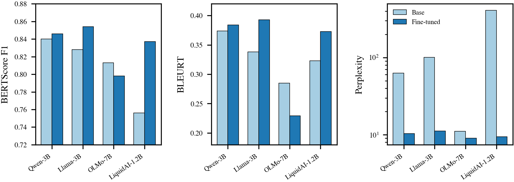

# User Turn LoRA

**LoRA Fine-Tuning for Next User Turn Prediction in Multi-Turn Dialogues**

QLoRA fine-tuning of open-source instruction-tuned LLMs (1.2B–7B parameters) to predict the next user utterance in multi-turn conversations. Trained on 6,000 samples from WildChat (open-domain) and Schema-Guided Dialog (task-oriented), evaluated with BERTScore, BLEURT, perplexity, and a blinded human study of 369 samples.



## Key Results

| Model                      | BERTScore F1 | BLEURT    | Perplexity |
| -------------------------- | ------------ | --------- | ---------- |
| Qwen-3B (fine-tuned)       | 0.846        | 0.384     | **10.4**   |
| Llama-3B (fine-tuned)      | **0.854**    | **0.393** | 11.2       |
| OLMo-7B (fine-tuned)       | 0.798        | 0.229     | 9.0        |
| LiquidAI-1.2B (fine-tuned) | 0.837        | 0.373     | 9.4        |
| GPT-4o-mini (few-shot)     | 0.847        | 0.401     | —          |

## Project Structure

```
├── src/                      # Modular training & evaluation pipeline
│   ├── main.py               # Entry point (full pipeline)
│   ├── config.py             # Centralized hyperparameters
│   ├── data.py               # Dataset loading & preprocessing
│   ├── model.py              # Model loading (QLoRA + 4-bit)
│   ├── train.py              # SFTTrainer wrapper
│   ├── evaluate.py           # Baseline & fine-tuned evaluation
│   ├── ablation.py           # Two-stage ablation study
│   ├── temperature_sweep.py  # Temperature sweep experiments
│   └── prompt_baseline.py    # GPT-4o-mini prompt baselines
├── scripts/                  # Shell scripts for cloud deployment
│   ├── run_all_models.sh     # Run pipeline for all 4 models
│   ├── gcloud_run.sh         # GCP VM provisioning & execution
│   └── run_docker.sh         # Docker-based execution
├── paper/                    # IEEE conference paper (LaTeX)
│   ├── IEEE-conference-template-062824.tex
│   ├── reference.bib
│   └── generate_figures.py   # Publication-quality figures (tueplots)
├── evaluator/                # Next.js app for blinded human evaluation
├── outputs/                  # Model evaluation results & CSVs
├── Dockerfile                # Reproducible GPU environment
├── docker-compose.yml        # Docker Compose with GPU support
└── requirements.txt          # Python dependencies
```

## Reproducing Results

### Prerequisites

- NVIDIA GPU with ≥40 GB VRAM (tested on A100-SXM4-40GB)
- Docker with NVIDIA Container Toolkit, **or** Python 3.11 + CUDA 12.1
- Hugging Face token (`HF_TOKEN`) for gated models
- (Optional) Weights & Biases API key (`WANDB_API_KEY`)

### Option 1: Docker (recommended)

```bash
# Clone and configure
git clone https://github.com/your-org/user_turn_lora.git
cd user_turn_lora
cp .env.example .env  # Add HF_TOKEN and WANDB_API_KEY

# Build image
docker compose build

# Run full pipeline for a single model
docker compose run userturn-lora --model Qwen/Qwen2.5-3B-Instruct

# Quick test run (small dataset, 1 epoch, no W&B)
docker compose run userturn-lora-test

# Run all 4 models sequentially
docker compose run userturn-lora --model Qwen/Qwen2.5-3B-Instruct
docker compose run userturn-lora --model meta-llama/Llama-3.2-3B-Instruct
docker compose run userturn-lora --model allenai/OLMo-3-7B-Instruct
docker compose run userturn-lora --model LiquidAI/LFM2.5-1.2B-Instruct
```

### Option 2: Local

```bash
pip install -r requirements.txt
pip install git+https://github.com/google-research/bleurt.git

# Download BLEURT checkpoint
wget https://storage.googleapis.com/bleurt-oss-21/BLEURT-20.zip
unzip BLEURT-20.zip
export BLEURT_CHECKPOINT=./BLEURT-20

# Run pipeline
python -m src.main --model Qwen/Qwen2.5-3B-Instruct
```

### Pipeline CLI

```bash
# Full pipeline (train + evaluate baseline + evaluate fine-tuned)
python -m src.main --model Qwen/Qwen2.5-3B-Instruct

# Skip baseline evaluation
python -m src.main --model Qwen/Qwen2.5-3B-Instruct --skip-baseline

# Evaluate existing adapter only
python -m src.main --model Qwen/Qwen2.5-3B-Instruct --skip-training

# Custom hyperparameters
python -m src.main --model Qwen/Qwen2.5-3B-Instruct --epochs 3 --lr 2e-4 --lora-r 8 --lora-alpha 64

# Disable W&B logging
python -m src.main --no-wandb
```

### Ablation Study

```bash
python -m src.ablation --model LiquidAI/LFM2.5-1.2B-Instruct
```

### Temperature Sweep

```bash
python -m src.temperature_sweep --model Qwen/Qwen2.5-3B-Instruct
```

### GPT-4o-mini Prompt Baselines

```bash
export OPENAI_API_KEY=your-key
python -m src.prompt_baseline
```

### Paper Figures

```bash
cd paper
python generate_figures.py
```

## Supported Models

| Model                 | HuggingFace ID                     | Parameters |
| --------------------- | ---------------------------------- | ---------- |
| Qwen2.5-3B-Instruct   | `Qwen/Qwen2.5-3B-Instruct`         | 3B         |
| Llama-3.2-3B-Instruct | `meta-llama/Llama-3.2-3B-Instruct` | 3B         |
| OLMo-3-7B-Instruct    | `allenai/OLMo-3-7B-Instruct`       | 7B         |
| LFM2.5-1.2B-Instruct  | `LiquidAI/LFM2.5-1.2B-Instruct`    | 1.2B       |

Any Hugging Face model supporting `apply_chat_template` can be added by extending `SPECIAL_TOKENS` in `src/config.py`.

## Optimal LoRA Configuration

Determined via a 56-experiment two-stage ablation on LiquidAI-1.2B:

| Parameter      | Value                      |
| -------------- | -------------------------- |
| LoRA rank (r)  | 8                          |
| LoRA alpha (α) | 64                         |
| LoRA dropout   | 0.0                        |
| Learning rate  | 2e-4                       |
| Epochs         | 3                          |
| Warmup ratio   | 0.1                        |
| Target modules | q, k, v, o, gate, up, down |

## Datasets

| Dataset                                                                          | Domain        | Train     | Eval    | Total     |
| -------------------------------------------------------------------------------- | ------------- | --------- | ------- | --------- |
| [WildChat-1M](https://huggingface.co/datasets/allenai/WildChat-1M)               | Open-domain   | 3,000     | 200     | 3,200     |
| [Schema-Guided Dialog](https://huggingface.co/datasets/GEM/schema_guided_dialog) | Task-oriented | 3,000     | 200     | 3,200     |
| **Total**                                                                        |               | **6,000** | **400** | **6,400** |

Samples are constructed as `(context, target)` pairs where context ends with an assistant turn and target is the next user utterance. Filtering: English only, ≥3 turns, seed=42.

## Human Evaluation

The `evaluator/` directory contains a Next.js application for blinded A/B human evaluation:

```bash
cd evaluator && bun install && bun run dev
```

## Environment Notes

- Tested on NVIDIA A100-SXM4-40GB (GCP)
- BLEURT requires TensorFlow 2.15.x (Python 3.11 compatible)
- Flash Attention 2 used where available (pre-built wheel in Dockerfile)
